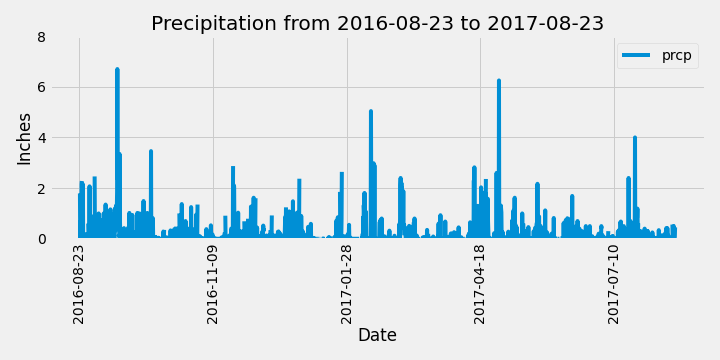
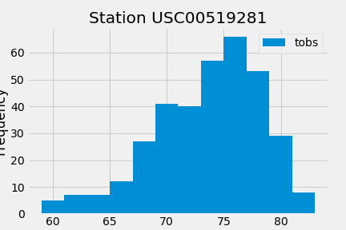
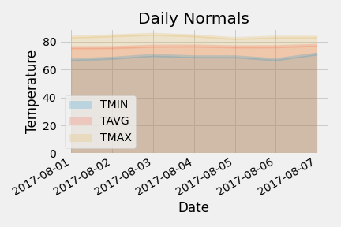

# Sqlalchemy-challenge

This Homework analyzes the climate data (years of daily precipitation and temperature at different locations/stations) in Hawaii that has been stored in a sqlite database.

### Modules employed in this study
* sqlalchemy
* flask
* pandas
* matplotlib
* numpy
* datetime
* scipy

### Precipitation Analysis

### Station Analysis
There are a total of 9 stations that have been included in this study. The most active station is station USC00519281, WAIHEE 837.5, HI US. Its temperature observation for the last 12 months is shown below. 

### Daily Normals (Highest, Lowest and Average Temperature)
The planned trip's daily temperature average has been calculated and ploted. 

More results have been stored in app.py for queries.

### Paired versus Unpaired t-test 
A paired t-test is used to compare the means of the same group under two different conditions, hence the total number of observations for each condition should be equal. 
An unpaired t-test is used to compare the means of two independent groups. t-test returns a p-value to indicate whether the difference of the means is statistically significant or not. In statistics, a p-value less than 0.05 is considered as statistically significant.

In this study, temperature in June and December are unrelated thus unpaired t-test should be used to compare their average temperatures. The average tempertures for June and December are 74.94 and 71.04, respectively. The unpaired t-test returned a p-value less than 0.001 (3.9 x 10^-191), indicating that the temperature difference between month June and December is despite very small (only ~4 degree F) but statistically highly significant.
